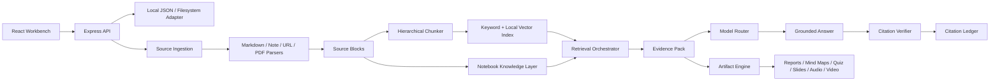

# SourceStudio AI Architecture

SourceStudio AI ist ein lokaler, NotebookLM-inspirierter Research Workspace mit einer quellengebundenen Pipeline. Quellen werden importiert, in Source Blocks zerlegt, gechunkt, in den Knowledge Layer übernommen, über Retrieval Runs zu Evidence Packs verdichtet und danach für Chat sowie Studio-Artefakte genutzt.

## Systemdiagramm

## Source Ingestion

`POST /api/notebooks/:id/sources` akzeptiert Markdown/Text, Notes, URLs und PDF-Payloads. Der Server erstellt eine Source, parst den Inhalt in ein `ParsedDocument`, speichert `SourceBlock`-Einträge, erzeugt Chunks, erstellt lokale Embeddings und aktualisiert Source- sowie Notebook-Knowledge-Objekte.

PDF-Dateien nutzen einen lokalen Text-Extraction-Fallback für Demo-Szenarien. Für produktive Layout- und OCR-Anforderungen ist ein dedizierter Parser als nächste Infrastrukturkomponente vorbereitet.

## Canonical Source Model

Die Engine verwaltet:

- Notebook
- Source
- SourceBlock
- Chunk
- Embedding
- KnowledgeObject
- ChatMessage
- RetrievalRun
- EvidencePack
- CitationLedger
- ArtifactJob
- Artifact
- ModelRun

Chunks behalten `source_id`, `block_ids`, Heading Path, Char Ranges sowie Page-/Timestamp-Platzhalter. Citations zeigen dadurch nicht nur auf Dokumente, sondern auf konkrete Source Blocks.

## Knowledge Layer

Pro Quelle entstehen Source Summary, Section Summaries, Claims, Entities, Dates, Numbers, Risks und Open Questions.

Pro Notebook entstehen Notebook Summary, Topic Map, Entity Index, Connections, Contradictions, Suggested Questions und Suggested Artifacts.

Die Objekte bleiben als strukturierte JSON-Daten mit Source References erhalten. Chat und Studio-Artefakte greifen auf dieselbe Evidence-Schicht zu.

## Retrieval

Der Retrieval Orchestrator kombiniert:

- aktive Quellen als Scope
- Query Intent
- Query Rewrites
- Keyword Overlap
- deterministische lokale Embeddings
- Heading-/Metadata-Signale
- Entity-Signale
- Summary-Kontext für Artefakt- und Syntheseaufgaben

Das Ergebnis ist ein Evidence Pack mit Evidence Items, Source References, Support Types, Constraints, relevanten Knowledge Objects und gespeichertem Retrieval Run.

## Model Router

Die App erkennt optionale Provider-Keys über lokale Environment-Variablen. Für reproduzierbare Tests und lokale Demo-Läufe steht ein deterministischer Fallback-Provider zur Verfügung. Die Architektur trennt Provider-Status, Model Runs und Generierung über einen Model Router.

Implementierte Rollen:

- `grounded_answer`
- `citation_verification`
- `artifact_generation`
- `summarization`
- `extraction`

Grounded Chat unterstützt externe LLM Provider über den Model Router. Wenn `ANTHROPIC_API_KEY`, `OPENAI_API_KEY` oder `GOOGLE_API_KEY` gesetzt ist und der Provider aktiv gewählt wird, läuft die Antwortgenerierung serverseitig über diesen Provider. Ohne Key oder bei Providerfehlern verwendet die App den lokalen Fallback und speichert die Model Runs transparent.

Studio-Artefakte können ebenfalls über `artifact_generation` an Anthropic, OpenAI oder Gemini geroutet werden. Diese Rolle ist getrennt steuerbar (`SOURCESTUDIO_ARTIFACT_PROVIDER` oder `DEFAULT_ARTIFACT_PROVIDER`) und bleibt standardmäßig lokal, damit Studio-Aktionen keine ungeplanten Providerkosten verursachen. Provider-Artefakte werden als JSON validiert, müssen die erwartete Artefaktform erfüllen und erhalten die kanonischen Evidence-Pack-Citations serverseitig. Bei ungültigem Provider-Output fällt die App auf den lokalen Artefaktgenerator zurück und speichert beide Model Runs.

## Grounded Answer Prompt

Der externe Provider-Pfad ist evidence-first:

- Antwort nur aus dem Evidence Pack.
- Keine freien allgemeinen Aussagen.
- Jede faktische Aussage benötigt eine Citation.
- Bei unzureichender Evidence wird abstained.
- Nur `source_id`, `block_id` und `evidence_id` aus dem Evidence Pack sind gültig.
- Provider-Output wird als JSON validiert.
- Ungültiger Provider-Output fällt auf den lokalen Grounded-Answer-Pfad zurück.

## Citation Verifier

Nach jeder Chat-Antwort erstellt die App ein Citation Ledger. Der Verifier splittet die Antwort in Claims, ordnet Citation IDs den Evidence Pack Items zu, prüft Token Overlap gegen die zitierte Evidence und klassifiziert Claims.

Unsupported Claims werden aus der final angezeigten Antwort entfernt. `GET /api/messages/:id/citations` liefert das gespeicherte Ledger.

## Artifact Engine

`POST /api/artifacts` erstellt einen Job, baut ein Evidence Pack, generiert ein typisiertes Artefakt, schreibt einen Export unter `.data/sourcestudio/artifacts` und speichert Source References. Audio Overview Artefakte können zusätzlich über ElevenLabs Text-to-Dialogue als MP3 gerendert und über `GET /api/artifacts/:id/media` ausgeliefert werden.

Unterstützte Artefakte:

- Report
- Mind Map
- Flashcards
- Quiz
- Data Table
- Slide Deck
- Audio Overview Transcript
- Video Overview Storyboard
- Infographic
